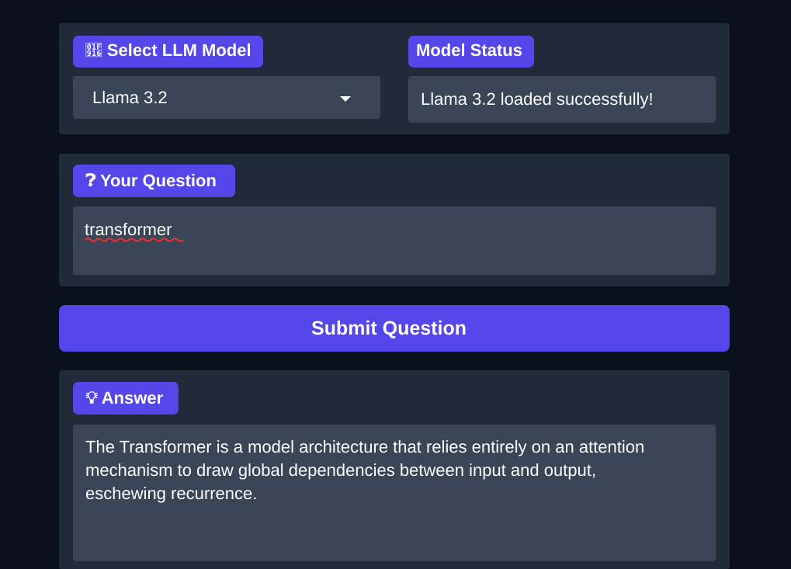

# Day 5 - Hugging Face Open-Source Models

This notebook explores how to use open-source LLMs from Hugging Face for text generation and document question answering. It loads transformer models with quantization, extracts text from a PDF, then builds a Gradio interface where users can choose a model and ask questions about the document.



## What This Project Covers

- Logging in to Hugging Face from a notebook
- Checking GPU availability before loading local LLMs
- Running a Hugging Face `pipeline` for a sample classification task
- Loading tokenizers and causal language models with `transformers`
- Using `bitsandbytes` 4-bit quantization to reduce GPU memory usage
- Reading PDF content with `pypdf`
- Building a document question-answering prompt
- Creating a Gradio app with model selection, status output, question input, and answer output
- Switching between open-source models such as Llama 3.2, Phi-4 Mini, and Gemma 3

## Project Structure

```text
Day5 Hugging Face Open-Source Models/
|-- assets/
|   `-- day5-open-source-llm-preview.svg
|-- Chat_with_documents_using_open_source_LLMs.ipynb
|-- requirements.txt
`-- README.md
```

## Requirements

- Python 3.12 or newer
- Jupyter Notebook, JupyterLab, or the VS Code notebook interface
- A Hugging Face account and access token
- A CUDA-capable GPU is strongly recommended for loading open-source LLMs
- A browser for opening the Gradio app

Running these models on CPU can be extremely slow. For the smoothest experience, use Google Colab with a GPU runtime or a local machine with enough VRAM.

## Installation

From the repository root, activate the virtual environment:

```powershell
.\.venv\Scripts\Activate.ps1
```

Install the required packages:

```powershell
pip install -r "Day5 Hugging Face Open-Source Models/requirements.txt"
```

With `uv`:

```powershell
uv pip install --python .\.venv\Scripts\python.exe -r "Day5 Hugging Face Open-Source Models/requirements.txt"
```

For CUDA builds of PyTorch, install the wheel that matches your GPU driver and CUDA version from the official PyTorch instructions before running the notebook.

## Hugging Face Login

The notebook uses:

```python
from huggingface_hub import login, notebook_login
```

You can log in interactively inside the notebook with:

```python
notebook_login()
```

Keep your Hugging Face token private. Do not commit tokens or notebook outputs that expose credentials.

## How to Run

1. Open `Chat_with_documents_using_open_source_LLMs.ipynb`.
2. Select the Python kernel that points to the repository `.venv`.
3. Run the installation and import cells.
4. Log in to Hugging Face when prompted.
5. Confirm that a GPU is available.
6. Run the model loading cells.
7. Run the PDF download and text extraction cells.
8. Launch the Gradio interface cell.
9. Open the local or public Gradio URL printed by the notebook.

When Gradio starts successfully, it prints a URL similar to:

```text
http://127.0.0.1:7860
```

If `share=True` is enabled, Gradio may also print a temporary public URL ending in `.gradio.live`.

## Main Code Flow

```text
Hugging Face login
  -> check GPU
  -> load tokenizer and quantized LLM
  -> download/read PDF
  -> extract document text
  -> build question-answering prompt
  -> generate answer with selected model
  -> display answer in Gradio
```

## Available Models

The Gradio interface defines a small model menu:

```text
Llama 3.2
Microsoft Phi-4 Mini
Google Gemma 3
```

Switching models may take time because the previous model is unloaded and the new model must be downloaded and loaded into GPU memory.

## Notes

- Some Hugging Face models require accepting license terms on the model page before they can be downloaded.
- Large model downloads can take several minutes and require a stable internet connection.
- `bitsandbytes` works best on Linux/CUDA environments. Windows users may have better results in WSL2 or Google Colab.
- Generated answers depend on the selected model, prompt, context length, and extracted PDF text quality.
